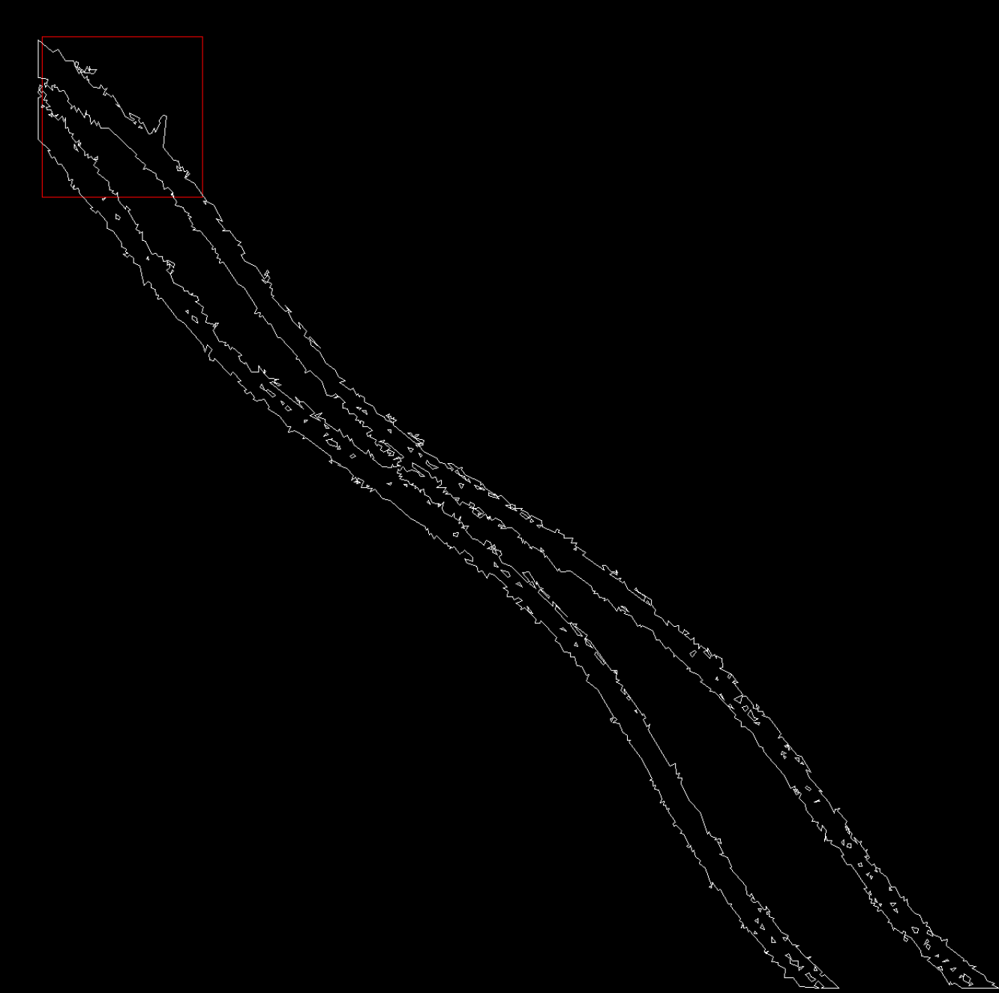

# Problem with Clipper and Intersect on certain polygons

I'm working on a project with a lot of polygons with different shapes and sizes. Clipper works for 99% of them, but 
sometimes it freezes in this portion of the code:

```go
func (c *Clipper) GetBottomPt(pp *OutPt) *OutPt {
	var dups *OutPt
	p := pp.Next
	for p != pp {
		if p.Pt.Y > pp.Pt.Y {
			pp = p
			dups = nil
		} else if p.Pt.Y == pp.Pt.Y && p.Pt.X <= pp.Pt.X {
			if p.Pt.X < pp.Pt.X {
				dups = nil
				pp = p
			} else {
				if p.Next != pp && p.Prev != pp {
					dups = p
				}
			}
		}
		p = p.Next
	}
	if dups != nil {
		//there appears to be at least 2 vertices at bottomPt so ...
		for dups != p {
			if !c.FirstIsBottomPt(p, dups) {
				pp = dups
			}
			dups = dups.Next
			for dups.Pt != pp.Pt {
				dups = dups.Next
			}
		}
	}
	return pp
}
```

Specifically in this loop:

```go
if dups != nil {
    //there appears to be at least 2 vertices at bottomPt so ...
    for dups != p {
        if !c.FirstIsBottomPt(p, dups) {
        pp = dups
        }
        dups = dups.Next
        for dups.Pt != pp.Pt {
            dups = dups.Next
        }
    }
}
```

The attached test `TestClipperIntersection`showcases just one of the many polygons that cause this issue.

To run the program (you might have to download clipper first):

`go test -v -run TestClipperIntersection`

# What I've tried so far

## Using CleanPolygons() and IoStrictlySimple
(tips from from: http://www.angusj.com/delphi/clipper/documentation/Docs/Overview/Rounding.htm)

I have tried using different distances in CleanPolygons, based on the complexity of the polygon. For example taking a fraction of the 
total polygon count as the distance value.
Every time I adjust the distance settings to get past one of the obstacles, I wind up with a new problem.
This approach doesn't seem very robust.

## Compiling with both 64- and 32-bit
Same problem in both binary versions

# One of the culprits
